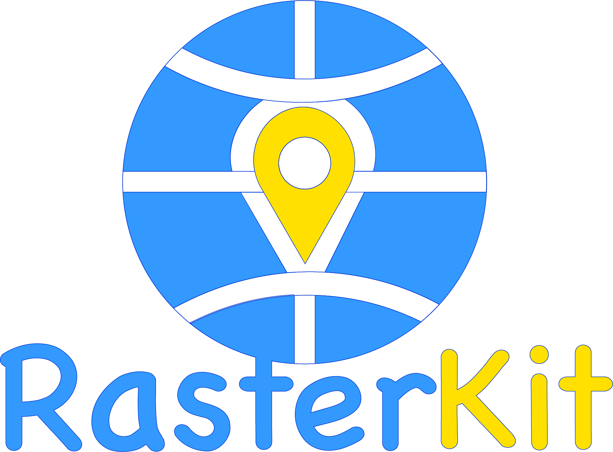

<p align="center">
  
</p>

# 🛠️ RasterKit

**A powerful Rust toolkit for working with geospatial raster data**

RasterKit is your go-to toolkit for working with geospatial raster data. Built with Rust for speed and reliability, it lets you analyze, manipulate, and extract data from TIFF and GeoTIFF files with ease, whether you're using the command-line interface or the API.

## ✨ Features

-   📊 **Data Analysis:** Peek inside TIFF/GeoTIFF files to understand their structure and metadata

-   🗺️ **Flexible Extraction:** Grab exactly the region you need using pixel coordinates, bounding boxes, or even a point and radius

-   🔵 **Shape Options:** Extract square or circular regions - perfect for analyzing areas around points of interest

-   🎨 **Colormap Magic:** Apply colormaps to turn grayscale data into beautiful visualizations

-   📈 **Data for Analysis:** Pull out raw numeric data as CSV, JSON, or NumPy arrays for further analysis

-   🗜️ **Smart Compression:** Convert between compression formats to optimize for size or speed

-   🚀 **Blazing Fast:** Written in Rust to handle even your largest datasets efficiently

-   🧩 **Build On It:** Extensible architecture makes it easy to add new formats and capabilities


## 📦 Installation

Clone the repository and build with Cargo:

```
git clone https://github.com/mauricemojito/rasterkit.git
cd rasterkit
cargo build --release
```

## 🚀 Usage

### Analyzing a TIFF File

Take a peek at what's inside your TIFF:

```
rasterkit input.tif
```

Want more details? Just add `--verbose`:

```
rasterkit input.tif --verbose
```

### Image Extraction

Pull out regions in whatever way makes sense for your workflow:

```
# The whole enchilada
rasterkit input.tif --extract --output extracted.tif

# Just a rectangle of pixels
rasterkit input.tif --extract --output region.tif --region=100,100,500,500

# A geographic bounding box (Web Mercator)
rasterkit input.tif --extract --output region.tif --bbox=-12626828,7529611,-12603877,7508004 --crs=3857

# Area around a point (WGS84 coordinates)
rasterkit input.tif --extract --output point_extract.tif --coordinate="-109.22624,56.13484" --radius=5000 --crs=4326 --shape=square

# Make it a circle instead
rasterkit input.tif --extract --output circle.png --coordinate="-109.22624,56.13484" --radius=5000 --crs=4326 --shape=circle
```

### Reprojection

Need your data in a different coordinate system? No problem:

```
rasterkit input.tif --extract --output reprojected.tif --coordinate="-109.22624,56.13484" --crs=4326 --proj=3857 --radius=5000
```

### Array Data Extraction

Get just the numbers for your analysis:

```
# Good old CSV
rasterkit input.tif --extract-array --output data.csv

# JSON if that's your thing
rasterkit input.tif --extract-array --array-format=json --output data.json

# NumPy arrays for Python folks
rasterkit input.tif --extract-array --array-format=npy --output data.npy
```

### Working with Colormaps

Make your data pop with color:

```
# Grab an existing colormap
rasterkit input.tif --colormap-output=colormap.sld

# Apply a colormap when extracting
rasterkit input.tif --extract --output colored.tif --colormap-input=colormap.sld

# Do it all at once - extract a region, make it circular, and colorize it
rasterkit input.tif --extract --output wow.png --coordinate="-109.22624,56.13484" --radius=5000 --crs=4326 --shape=circle --colormap-input=colormap.sld
```

### Converting Compression

Optimize your files:

```
# Remove compression for maximum compatibility
rasterkit input.tif --convert --output uncompressed.tif --compression-name=none

# Deflate for good compression with wide support
rasterkit input.tif --convert --output compressed.tif --compression-name=deflate

# ZStd for the best compression ratio
rasterkit input.tif --convert --output compressed.tif --compression-name=zstd
```

## 🧠 API Usage

Use RasterKit in your Rust code:

```
use rasterkit::api::RasterKit;

fn main() -> Result<(), Box<dyn std::error::Error>> {
    // Create a new RasterKit instance
    let kit = RasterKit::new(Some("rasterkit.log"))?;

    // Check out what's in this file
    let analysis = kit.analyze("input.tif")?;
    println!("{}", analysis);

    // Extract a square region by pixels
    kit.extract(
        "input.tif",
        "output.tif",
        Some((100, 100, 500, 500)), // region: x, y, width, height
        None,                       // bbox
        None,                       // coordinate
        None,                       // radius
        None,                       // shape
        None,                       // crs
        None,                       // colormap
    )?;

    // Extract a circular region around a point
    kit.extract(
        "input.tif",
        "geo_output.png",
        None,                         // region
        None,                         // bbox
        Some("-109.22624,56.13484"), // coordinate
        Some(5000.0),                // radius in meters
        Some("circle"),              // shape (circle for a round extract!)
        Some(4326),                  // crs (WGS84)
        Some("colormap.sld"),        // colormap
    )?;

    // Get some data for analysis
    kit.extract_to_array(
        "input.tif",
        "data.csv",
        "csv",
        None, // extract entire image
    )?;

    Ok(())
}
```

## 🛣️ Roadmap

-   🌈 Support for more raster formats (GeoPackage, NetCDF, etc.)

-   🔮 Data visualization features

-   ⚡ Parallel processing for even faster performance

-   🧪 Machine learning integration


## 🤝 Contributing

Jump in and help out! Whether you find a bug, have a cool idea for a new feature, or just want to improve the docs, your contributions are welcome. Just open a PR and we'll go from there.

## 📝 License

This project is licensed under the MIT License - see the LICENSE file for details.